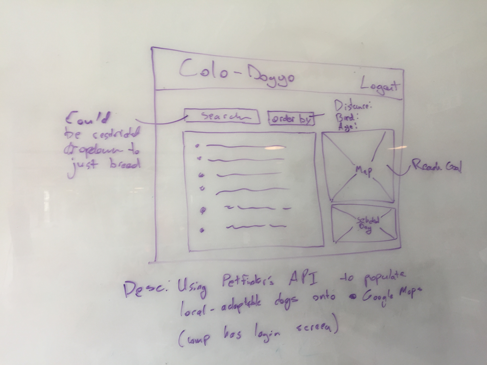

# [Link to my Trello](https://trello.com/b/tbB7GBR2/project-2-wdi3)

# [Link to my Heroku](https://arcane-lowlands-16280.herokuapp.com/)

Tools Used: 
	-Javascript, HTML, CSS, Mongo, Mongoose, Various NPM libraries, AJAX, EJS, Bootstrap, JavaScript, Express, Node

App Description:

The purpose of this app is to simulate what Tinder achieves with dating but instead with dogs. Adoptable dogs will be populated on the screen once the user has logged in / created an account. Each dog will present the user with two options, "Love This Dog" and "Hate This Dog".

"Love This Dog" stores that dog object into a new array so that the user can access the dogs they've "Loved" by clicking on the option next to their logout. 

"Hate This Dog" removes the dog from the page and from the database as well so that the user no longer sees that dog as an option.

What I'd Still Like To Accomplish:

I anticipate the app having the ability to store the dog data to each individuals profile and save that data so that when they log in, they can access their list of "Loved Dogs".

I also plan to have this deployed onto a Heroku server so that the app is public and useable.

The map begins to stay with the user as they scroll down but quickly stops